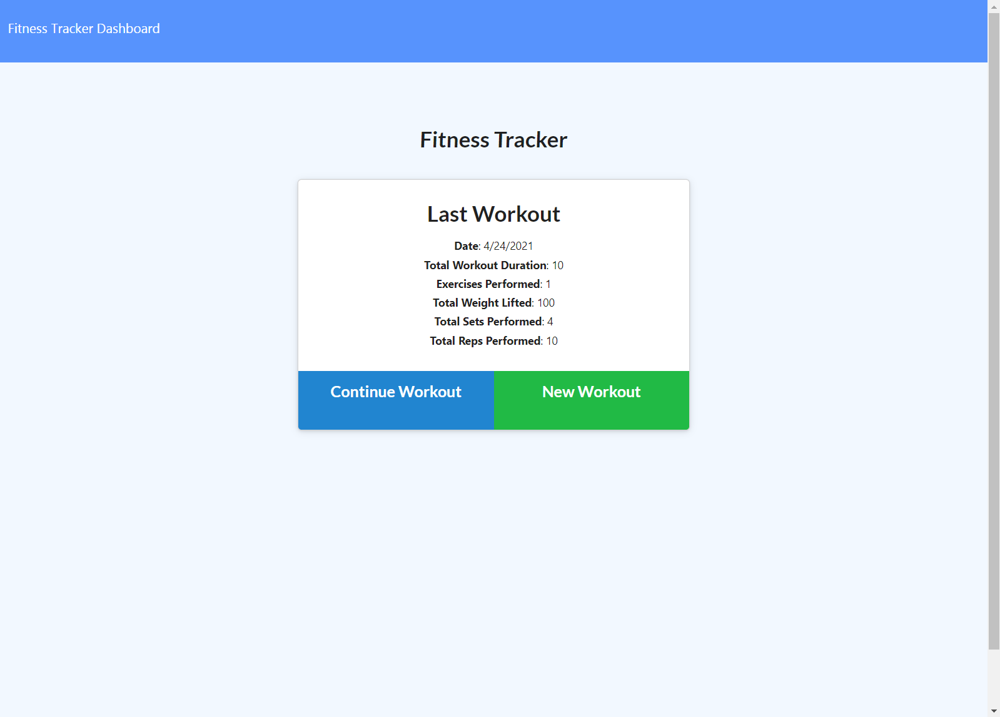
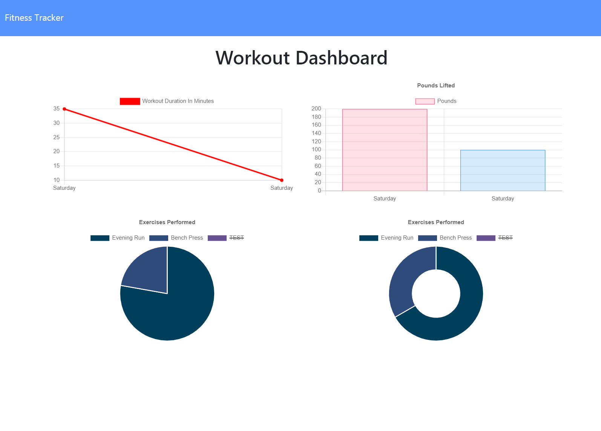

## Workout Tracker

## Table of Contents
1. [The Assignment](#the-assignment)
2. [Demonstration](#demonstration)
3. [Usage](#usage)
4. [Credits](#credits)
5. [Questions](#questions)

## The Assignment
Modify starter code to get a workout tracking application functioning correctly. User should be able to add exercises to their most recently logged workouts, create new workouts, and view stats for combined weight and duration of multiple exercises across different workouts.

## Demonstration

## Usage

Simply follow this link to use the application.

https://shrouded-temple-08400.herokuapp.com/

## Credits

I was helped in this assignment by my TA Ryan Skog in our tutoring session.

## Questions

For any questions or comments, here is my contact information.
 
GitHub: https://github.com/dorrianweber
 
Email address: dorrianweber@gmail.com
